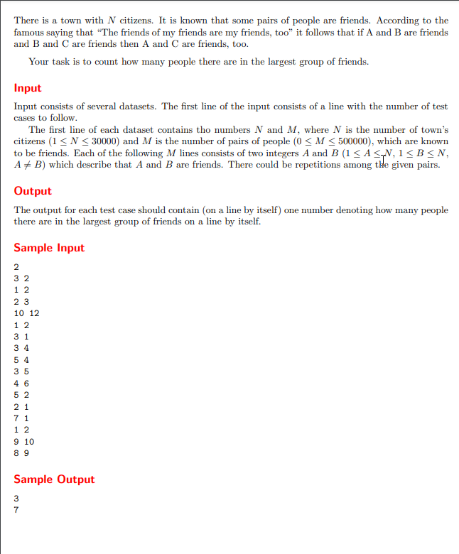

First input is the number of TestCases

the second 2 inputs are N and M 
N --> Numebr of Citizens
M --> Number of Friendships

After that we will  enter number of lines the same number of the M
Each line will have 2 inputs A and B
A is the first Person and B is the second Person
